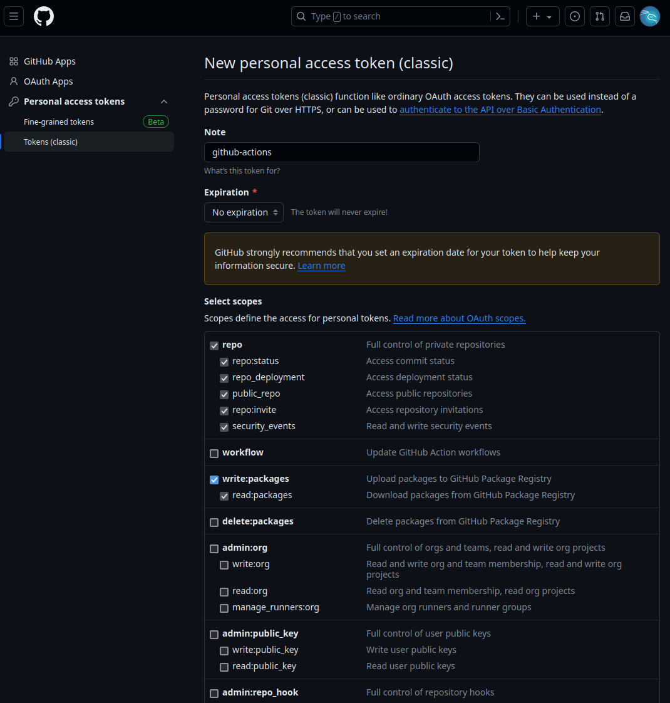
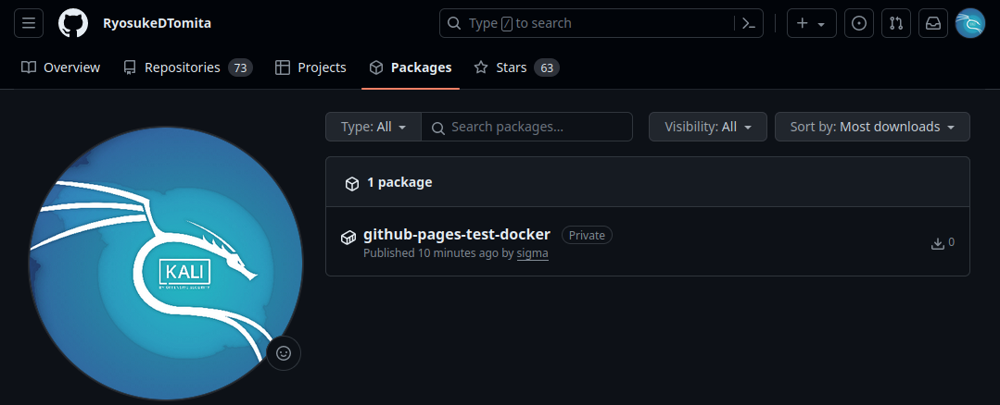
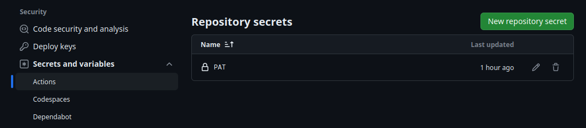

# GitHub Pages を使ってみる


[](https://github.com/RyosukeDTomita/github-pages-test-docker/actions/workflows/gh-pages.yml)

## INDEX

- [ABOUT](#about)
- [LICENSE](#license)
- [ENVIRONMENT](#environment)
- [PREPARING](#preparing)
- [HOW TO USE](#how-to-use)
- [ABOUT](#about)

---

## ABOUT

Using github pages with docker container.

---

## LICENSE

---

[UN LICENSE](./LICENSE)

---

## ENVIRONMENT

- react
- docker
- github pages
- github actions

---

## PREPARING

### package.json の設定

FIXME!

```json
"homepage": "https://ryosukedtomita.github.io/github-pages-test"
```

### GitHub 側の設定

- リポジトリの設定から Pages --> Build and deployment を GitHub Actions を選択する。

### github actions の設定

docker でコンテナを作成し，その中で build したものを github-pages に渡している。

#### GitHub Container Registry にイメージを push する

- Personal Access Token の作成が必用。アカウントの設定ページから，**Developer settings** --> Personal access tokens --> Tokens(classic) --> Generate new token (classic)から作成する。
- この際に write:packages 等の必用な権限をオンにする。自分は一旦以下のように設定。
  
- 表示されたトークンを保存する。自分は環境変数`GITHUBPAT`に保存した。
- 試しに push してみる。

```shell
echo $GITHUBPAT | docker login ghcr.io -u RyosukeDTomita --password-stdin
docker push ghcr.io/ryosukedtomita/github-pages-test-docker:latest
```

- うまくいけば Packages に保存されているはず。
  

#### GitHub Actions Secrets に PAT を保存

- settings --> Secrets and variables --> から変数名`PAT`で Repository secrets を登録する。
  

## HOW TO USE

just `git push origin master` and go to your own url set by [package.json](./package.json)

---

## MEMO

### Branch "master" is not allowed to deploy to github-pages due to environment protection rules.

- github actions の deploy 時に何故が deploy が失敗する。
- おそらくバグだとおもわれ(2024/02/02)，Pages の設定ページの Source を一度 Deploy from a branch に変更して Branch を main から master に変更した後，再度 Source を GitHub Actions に変更したら直った。
